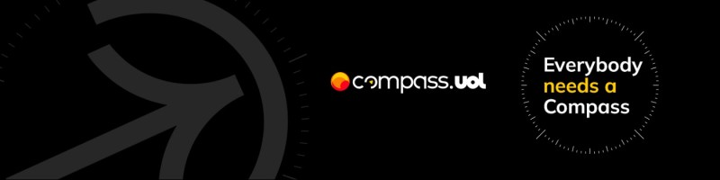

<a href="https://compass.uol/pt/home/" id="banner"> 
    
  </a>


 

 

 


## 📝 Informações

- 🧑🏽 **Nome** - Emanuel Silva lira
- 🎓 **Curso** - Análise e  Desenvolvimento de Sistemas
- 📅 **Semestre** - 3º Semestre
- 🏙️ **Cidade** - Campina Grande - PB
<br>
<a href="https://gitlab.com"></a>


--- 

## 📱 Contato
[](https://www.instagram.com/emanuell.sl_/) [](https://www.linkedin.com/in/emanuel-silvalb/) [](https://github.com/Emanuel-Lira)


# Projeto de Testes Automatizados com K6

Este repositório contém os scripts e configurações para a execução de testes automatizados utilizando a ferramenta [K6](https://k6.io/). O objetivo do projeto é validar fluxos críticos, endpoints de APIs e comportamentos esperados no sistema.

## Estrutura de Pastas

### `data`

Contém os dados necessários para os testes.

- **`dynamic`**: Scripts que geram dados dinâmicos para os testes, como:
    - `dynamicProductData.js`: Dados dinâmicos de produtos.
    - `dynamicUserData.js`: Dados dinâmicos de usuários.
- **`static`**: Arquivos JSON com dados estáticos, como:
    - `staticData.json`: Dados pré-definidos para serem utilizados nos testes.

### `reports`

Relatórios gerados após a execução dos testes. Exemplos:

- `resultadosFluxoCompraConcluido.html`
- `resultadosSmokeGETUsuarios.html`

### `scenarios`

Scripts que definem os cenários de testes.

- **`carrinhos`**: (Pasta reservada para testes relacionados a carrinhos de compras).
- **`fluxos`**: Fluxos específicos de testes, como:
    - `processoCompraConcluido.js`: Fluxo de compra concluída.

### `services`

Scripts para interagir com os endpoints de APIs, organizados por funcionalidades:

- **`login`**: Autenticação.
- **`produtos`**: Manipulação de produtos.
- **`usuarios`**: Operações relacionadas a usuários.

### `support`

Scripts de suporte e configurações compartilhadas, como:

- **`base`**: Contém funções base utilizadas em vários testes.
- **`config`**: Configurações do ambiente, como o arquivo `environments.js`.

## Pré-requisitos

- Node.js (v16 ou superior)
- K6 (versão mais recente)

## Instalação

1. Clone o repositório:
    
    ```
    git clone https://github.com/seu-usuario/projeto-k6.git
    ```
    
2. Instale as dependências do projeto:
    
    ```
    npm install
    ```
    

## Execução dos Testes

### Testes Locais

Execute os testes localmente utilizando o K6:

```
k6 run scenarios/fluxos/processoCompraConcluido.js
```

### Relatórios

Os relatórios dos testes são gerados automaticamente na pasta `reports` em formato HTML.

## Estrutura de Configuração

O arquivo `environments.js` é usado para configurar os ambientes, como:

- URL base da API.
- Variáveis de ambiente para autenticação.

## Contribuição

1. Faça um fork do repositório.
2. Crie uma nova branch:
    
    ```
    git checkout -b minha-feature
    ```
    
3. Realize suas alterações e faça commit:
    
    ```
    git commit -m "Minha nova feature"
    ```
    
4. Envie as alterações:
    
    ```
    git push origin minha-feature
    ```
    
5. Abra um Pull Request.


## 🤝 Citações e Colaborações

- [Gabriel Castro](https://gitlab.com/leirbagOstarc)
- [Giusepp de Couto](https://gitlab.com/giuuppa)
- [igor Coelho](https://gitlab.com/igorcoelh0)
- [Isadora](https://gitlab.com/isaapmachado2001)
- [Betania](https://gitlab.com/betaniaAmaral)
- [Diego Nachtigall](https://gitlab.com/ditsguts)
- [Julia Fick](https://gitlab.com/JuFick)
- [Eduarda Vieira](https://gitlab.com/eduarda-wq)
- [Diego P](https://gitlab.com/dgomp)
- [Carlos Daniel](https://gitlab.com/carlos-daniel1)

## Licença

Este projeto está licenciado sob a licença MIT.